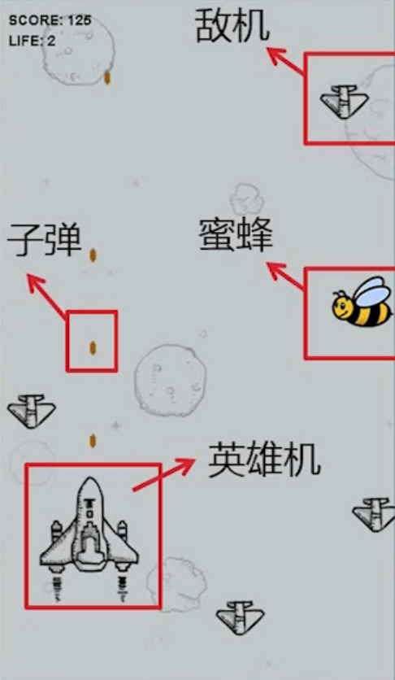

### 一、总体设计

- 游戏中，玩家驾驶“英雄机”，在空中进行战斗
- ”英雄机“跟随鼠标移动。玩家通过控制鼠标来移动”英雄机“的位置。
- ”英雄机“可以连续地自动地发射”子弹“，打掉”敌机“和”蜜蜂“来获得不同的奖励：  
    - 每打掉1架”敌机“，奖励5分
    - 每打掉1个”蜜蜂“，随机奖励一条生命或40发双倍火力
       - 双倍火力每次消耗2发，直到消耗完就变回单倍火力
- 如果”英雄机“撞上”敌机“或”蜜蜂“
    - 每撞1次，将减少1条生命，并且双倍火力清零
    - 直到所有生命减完，游戏结束。  

    

### 二、游戏过程

- 启动游戏：
    - ”英雄机“起始分数为0分，起始生命为3次。
- 开始游戏：
    - 界面中，任意位置，单击鼠标左键，开始游戏。
- 暂停游戏：
    - 游戏进行中，鼠标移出游戏界面，游戏自动暂停。
    - 游戏暂停状态中，鼠标移回游戏界面，游戏自动恢复运行。
- 游戏结束：
    - 当生命值减为0时，游戏自动结束。
    - 游戏结束后，单击游戏界面，可重置回初始状态。

### 三、类的设计

- 定义四个对象类：Hero、Airplane、Bee、Bullet
- 分别拥有5个相同属性：width、height、x、y、image
- 共有的属性，可以抽象出一个共同的父类：Flyer

<table>
    <tr>
        <th colspan="2">Flyer</th>
    </tr>
    <tr>
        <td>width</td><td>int</td>
    </tr>
    <tr>
        <td>height</td><td>int</td>
    </tr>
    <tr>
        <td>x</td><td>double</td>
    </tr>
    <tr>
        <td>y</td><td>double</td>
    </tr>
    <tr>
        <td>image</td><td>string</td>
    </tr>
</table>
 
<table>
    <tr>
        <th colspan="2">Hero</th><th colspan="2">Airplane</th>
        <th colspan="2">Bee</th><th colspan="2">Bullet</th>
    </tr>
    <tr>
        <td>//双倍火力 doubleFire</td><td>int</td>
        <td>//下落速度 ySpeed</td><td>int</td>
        <td>//水平速度 xSpeed</td><td>int</td>
        <td>//子弹速度 ySpeed</td><td>int</td>
    </tr>
    <tr>
        <td>//剩余生命 life</td><td>int</td>
        <td>//分值 score</td><td>int</td>
        <td>//下落速度 ySpeed</td><td>int</td>
        <td></td><td></td>
    </tr>
    <tr>
        <td>//获得分数 score</td><td>int</td>
        <td></td><td></td>
        <td>//奖励类型 awardType</td><td>obj</td>
        <td></td><td></td>
    </tr>
</table>
 

### 四、功能设计

1. 每个飞行物都可以移动，但移动的方式各不相同。
    - 因此可以在父类Flyer中定义一个抽象方法step(),子类通过继承后分别实现自己的移动方法。
2. 飞行物一旦”飞“出界面之后就要销毁，但每个销毁的条件不同。
    - 可以 同上以相同的方式定义outOfBounds()抽象方法。
3. 英雄机特有方法：
    - 英雄机随鼠标移动，需要有一个移动方法: move()。
    - 英雄机可以发射子弹：
        * 如果双倍火力的子弹数不为0，则每次发射2发子弹；
        * 如果双倍火力的子弹数为0，则每次发射1发子弹；
        * 因为创建的子弹数可能不同，所以 可以使用数组返回1个或多个子弹对象 shoot()。
    - 英雄机击中不同敌人，会获得不同的奖励：需要一个获得分数或奖励的方法getScore_Award()。
    - 英雄机会被敌机撞上，需要一个方法专门判断英雄机是否和某个敌机相撞hit()。